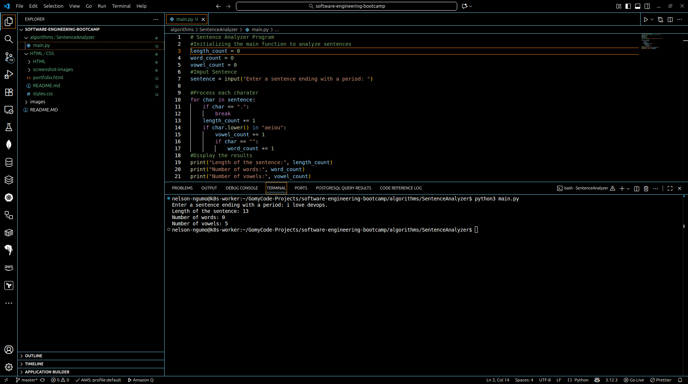

# Sentence Analyzer

## 📌 Project Overview
This project is a simple algorithm written in Python that analyzes a sentence (ending with a period `"."`) character by character.  
It calculates:
1. **The length of the sentence** (number of characters excluding the final period).  
2. **The number of words** (words are assumed to be separated by a single space).  
3. **The number of vowels** (`a, e, i, o, u` in both lowercase and uppercase).  

This was created as part of a checkpoint in the **Software Engineering Bootcamp**.

---

## 🚀 How It Works
- The program reads a sentence from the user.  
- It loops through each character until it finds a period (`"."`).  
- Three counters are updated during the loop:
  - `length_count` → counts characters.  
  - `word_count` → counts spaces + 1 (number of words).  
  - `vowel_count` → counts vowels (a, e, i, o, u).  
- Finally, the program displays the results.

---

## 🛠️ Requirements
- Python 3.12+ (or any modern Python 3 version).  
- VS Code or any text editor.  

Check Python version:
```bash
python3 --version
