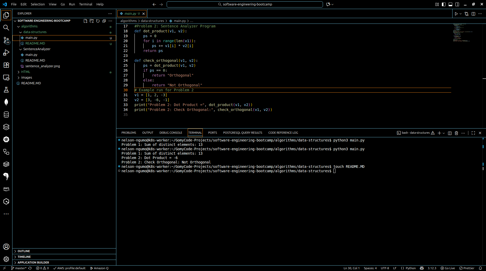

# Data Structures – Checkpoint Algorithms

This project contains solutions for two algorithmic problems using arrays in Python.  
The problems demonstrate working with distinct elements of sets and performing vector operations such as dot products.

---

## 📌 Problem 1: Sum of Distinct Elements

**Description:**  
Given two sets (arrays), find the sum of all elements which are present in either of the given sets, but not in both.  

**Example:**  
- Set 1: `[3, 1, 7, 9]`  
- Set 2: `[2, 4, 1, 9, 3]`  
- Distinct elements: `4, 7, 2`  
- **Output:** `13`

---

### 🔹 Algorithm (Pseudocode)
