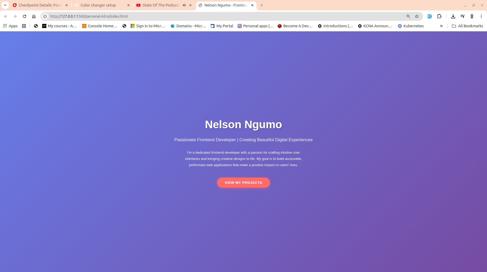

# Personal Intro Page

A modern, responsive landing page showcasing my profile as a frontend developer.

## Features

- **Hero Section**: Clean, centered layout with gradient background
- **Personal Branding**: Name, subtitle, and professional description
- **Interactive Button**: "View My Projects" CTA with hover effects
- **Responsive Design**: Mobile-friendly layout
- **Smooth Animations**: Fade-in effects and button interactions

## Technologies Used

- HTML5
- CSS3 (Flexbox, Grid, Animations)
- Modern CSS features (gradients, transforms, transitions)

## Project Structure

```
personal-intro/
├── index.html      # Main HTML structure
├── style.css       # Styling and animations
└── README.md       # Project documentation
```



## Manual Improvements Added

- Custom letter-spacing on button for better readability
- Advanced box-shadow effects with hover states
- Fade-in animation for hero content
- Enhanced typography hierarchy

## How to Run

1. Open `index.html` in any modern web browser
2. View the responsive design by resizing the browser window

## Browser Compatibility

Works in all modern browsers including Chrome, Firefox, Safari, and Edge.